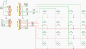

# arduino-keyboard

A 4x4 matrix keypad wired to an Arduino Uno, turned into a mini macro
keyboard. The Arduino scans the keypad and sends the pressed key over
Serial; a Python script on the desktop reads that Serial stream and fires
the matching keystroke (numbers, arrows, backspace, enter).



## How it works

```
[4x4 keypad] --> [Arduino Uno]  --Serial (9600 baud)-->  [PC running Python]  --> keystroke
   matrix           scans rows/cols                        maps char to key         sent to OS
```

1. **`firmware/matrixCode/matrixCode.ino`** scans the keypad by driving each
   row LOW one at a time and checking which columns read LOW. When a new
   key press is detected, it prints that key's character to Serial.
2. **`software/ArduinoIDE_to_Desktop.py`** listens on the Arduino's Serial
   port, looks up the incoming character in a key map, and uses PyAutoGUI
   to send the corresponding keystroke to the computer.

## Repo structure

```
arduino-keyboard/
├── firmware/
│   └── matrixCode/
│       └── matrixCode.ino     # Arduino sketch: scans the matrix, sends keys over Serial
├── hardware/
│   ├── printed-base/          # 3D-print files for the enclosure
│   └── wiring/
│       └── matrixMap.svg      # matrix layout / wiring diagram
├── software/
│   └── ArduinoIDE_to_Desktop.py  # Serial -> keystroke bridge (PyAutoGUI)
├── .gitattributes
├── .gitignore
└── README.md
```

## Hardware

- Arduino Uno
- 4x4 matrix keypad (16 buttons)
- 8 jumper wires (4 rows + 4 columns)

### Pin mapping

| Keypad | Arduino pin | Mode |
|---|---|---|
| Row 1–4 | D5, D4, D3, D2 | `OUTPUT` |
| Col 1–4 | D9, D10, D11, D12 | `INPUT_PULLUP` |

### Key layout

```
1  2  3  A
4  5  6  B
7  8  9  C
*  0  #  D
```

## Firmware — `matrixCode.ino`

- Rows are driven `HIGH` by default and pulled `LOW` one at a time while
  scanning; columns use internal pull-ups, so a column reads `LOW` when a
  button bridges it to the active row.
- A `keyState[][]` array tracks whether each key was already down, so a key
  fires once on press rather than spamming while held.
- A short `delay(20)` after a detected press acts as basic debounce.
- On detecting a new press, the sketch does `Serial.println(key)` — that's
  the one line of communication the Python script depends on.

Flash this sketch to the Uno with the Arduino IDE before running the Python
bridge.

## Software — `ArduinoIDE_to_Desktop.py`

Maps each keypad character to a PyAutoGUI key:

| Keypad | Action | Keypad | Action |
|---|---|---|---|
| `1`–`9`, `0` | same digit | `A` | `up` |
| `*` | `backspace` | `B` | `down` |
| `#` | `enter` | `C` | `left` |
| | | `D` | `right` |

## Setup

1. **Flash the Arduino**
   - Open `firmware/matrixCode/matrixCode.ino` in the Arduino IDE.
   - Wire the keypad per the pin mapping above (or per `hardware/wiring/matrixMap.svg`).
   - Select your board/port and upload.
   - **Close the Serial Monitor** afterward — it locks the port and the
     Python script won't be able to connect while it's open.

2. **Run the desktop bridge**
   ```bash
   pip install pyserial pyautogui
   ```
   - Open `software/ArduinoIDE_to_Desktop.py` and set `SERIAL_PORT` to match
     your Arduino (e.g. `COM4` on Windows, `/dev/cu.usbmodemXXXX` on Mac).
   - Run it:
     ```bash
     python software/ArduinoIDE_to_Desktop.py
     ```
   - Press keys on the keypad — you should see them logged in the terminal
     and reflected as keystrokes on your machine.

## Hardware files

3D-print files for the keypad's printed base live in `hardware/printed-base/`.

## Customizing

- **Change what keys do:** edit `KEY_MAP` in `ArduinoIDE_to_Desktop.py` —
  any PyAutoGUI-recognized key name works, so this can become a macro pad
  (media keys, shortcuts, etc.) instead of a numeric keypad.
- **Change the physical layout:** edit the `keys[][]` array in
  `matrixCode.ino` to relabel buttons without touching wiring.
- **Different pins:** update `rowPins[]` / `colPins[]` in the sketch to
  match your wiring.
